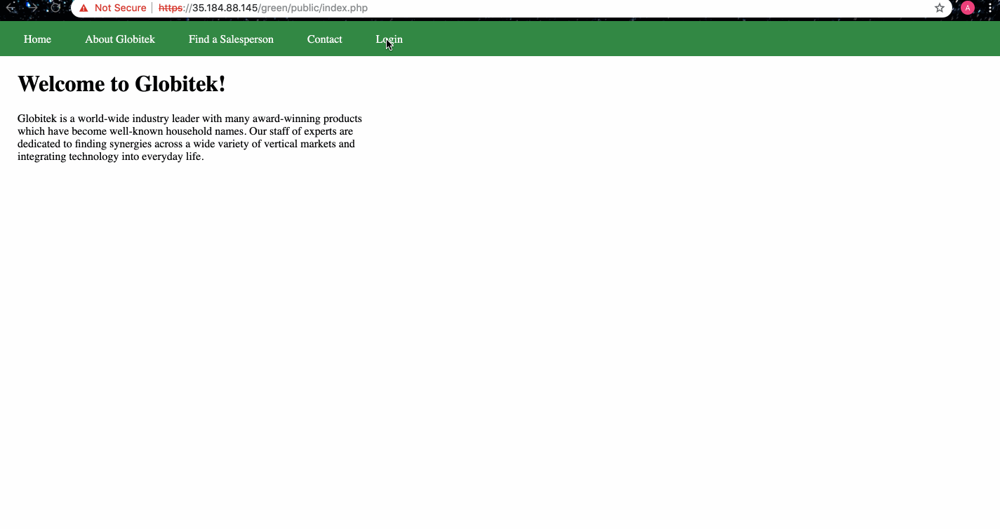
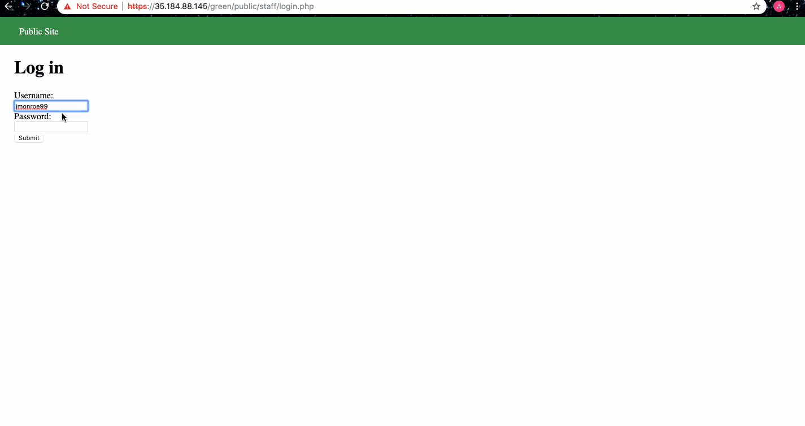
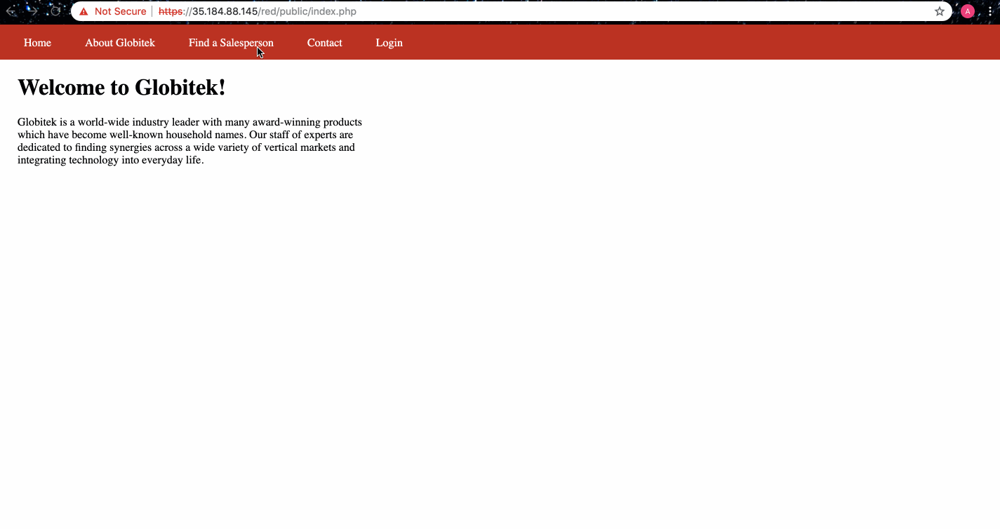
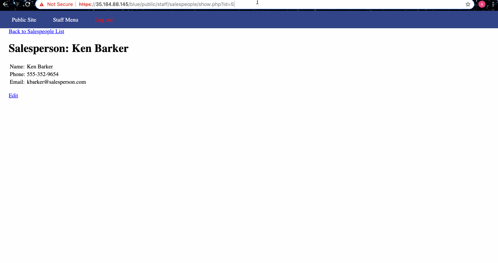

# WEEK 9 - Pentesting Live Targets

Time spent: 4 hours spent in total

The six possible exploits are:

1. Username Enumeration
2. Insecure Direct Object Reference (IDOR)
3. SQL Injection (SQLi)
4. Cross-Site Scripting (XSS)
5. Cross-Site Request Forgery (CSRF)
6. Session Hijacking/Fixation

## GREEN

### Vulnerability 1 - Stored Cross Site Scripting Attack

* Enter the following script into the feedback section of the public site:
   ``
* Then log into the site and view the feedback.
* The alert that pops up shows that a stored XSS attack has been performed.

### Vulnerability 2 - Username Enumeration

* Try logging into a real user's account with the wrong password, and you get a message in bold letters.
* Log in with a random username and password, and you get a message which does not have bold letters.
* An attacker can use this clue to find valid usernames.

## RED

### Vulnerability 3 - Insecure Direct Object Reference

* Enter different numbers as the "id" in the URL by changing the GET request until you find access to the hidden user's accounts.
* id = 10, and 11 give hidden user accounts.

## BLUE

### Vulnerability 4 -SQL Injection Attack

* Similar to the IDOR attack, change the GET request by entering an SQL query instead of a valid salesperson's id.
* The following SQL queries can be used to perform the SQLi attack:
      ` ' OR SLEEP(2) = 0 --' ` --> this makes the database wait for 2 seconds before querying
      ` ' OR 1=1 --' ` --> This returns the first salesperson's id everytime.
 
 
